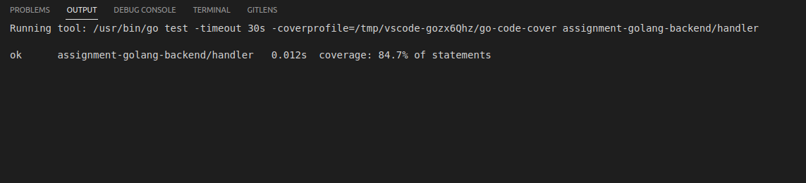

# assignment-golang-backend

Created by Ratu Raihan Amany

## Description

This is an API documentation for E-Wallet Backend created for the purpose of fulfilling the Digitalent Batch 03 assignment.

## How to Setup

1. Copy the script from `wallet_db_ratu_amany.sql` to postgresql terminal to seed the database

2. Create the database connection with your appropriate database settings

## How to Run

1. Run `go run .` in terminal to start the API Program.

2. Open [swagger link](http://localhost:8081/docs) [http://localhost:8081/docs] in your browser and try the API endpoint from there.

## ERD

## Unit Testing

Coverage:

- Repository: 73.2%

- Usecase: 58.1%

- Handler: 84.7%

 

## Not Complete Yet 
- API for reset password 

- User can get total data transactions